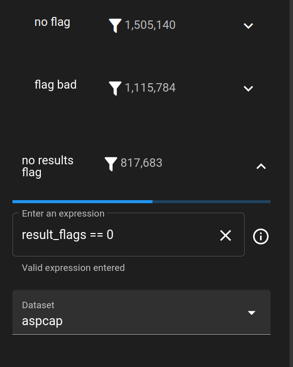
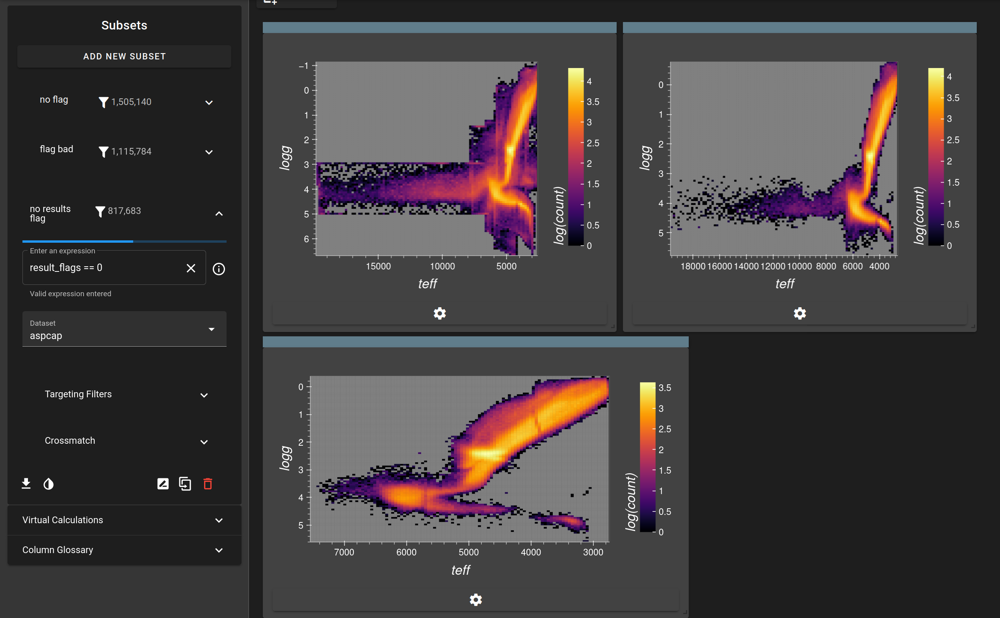

Often people are quite confused about the differences between flagging values in SDSS data. Here's how you can get a quick look at it.

## Example: looking at the impact of flagging columns

Let's create three subsets. Both on the `ASPCAP` dataset, but with three differences in flagging.

1. No filtering at all
2. `flag_bad == 0`
3. `result_flags == 0`

!!! note
    You ***must disable*** the default `purely non flagged` option in the **Quick Flags**, under the **Targeting Filters** menu.

/// caption
*The setup described above. Use the Expression field to setup the flagging checks.*
///

Now create 3 heatmaps, plotting `teff` vs `logg` and set the bintype to `count` with a logscale. Make sure to flip the axes, and set the Subset in each to the correct one.

/// caption
*The setup described above. Top left: no filtering. Top right: flag bad == 0. Bottom: result_flags == 0. Look at the structural differences.*
///

