Let's create and compare a few color magnitude diagrams.

!!! note
    This guide is slightly outdated, but everything still applies. The plots just look different, really.

To start, we'll load the `best` reductions, which contain SDSS-V's best parameter estimates for all stars. This is automatically done when you load the app.

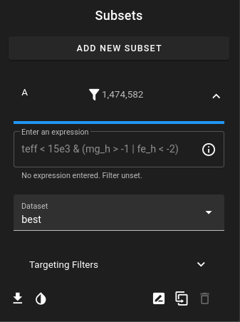

We can create a new heatmap or scatter plot with the **Add View** button. 

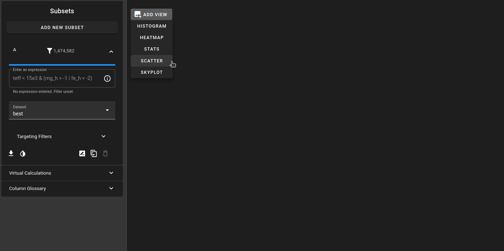

Let's add a heatmap. This will automatically create a basic HR (teff vs. logg; without flipped axes), but we can flip them very easily with the plot settings menu.

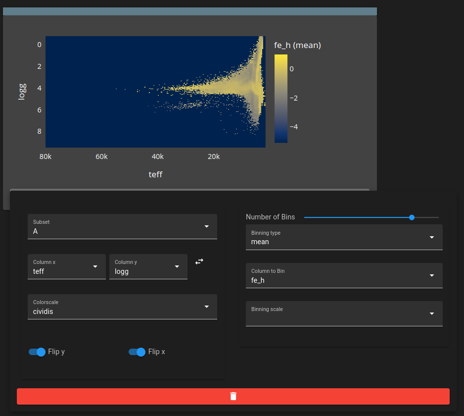
/// caption
*Heatmap with expanded settings menu. Both axes are set to be flipped.*
///

Let's say we want to plot Gaia magnitudes, say *BP - RP* colour against absolute Gaia *G* magnitude. There isn't a `bp_rp` nor a `G` absolute magnitude column in the SDSS-V dataset by default, but there is the relevant information to make it.

To solve this, we can use the **Virtual Calculations** Menu in the side bar to create both a `bp_rp` and `g_abs_mag` column.

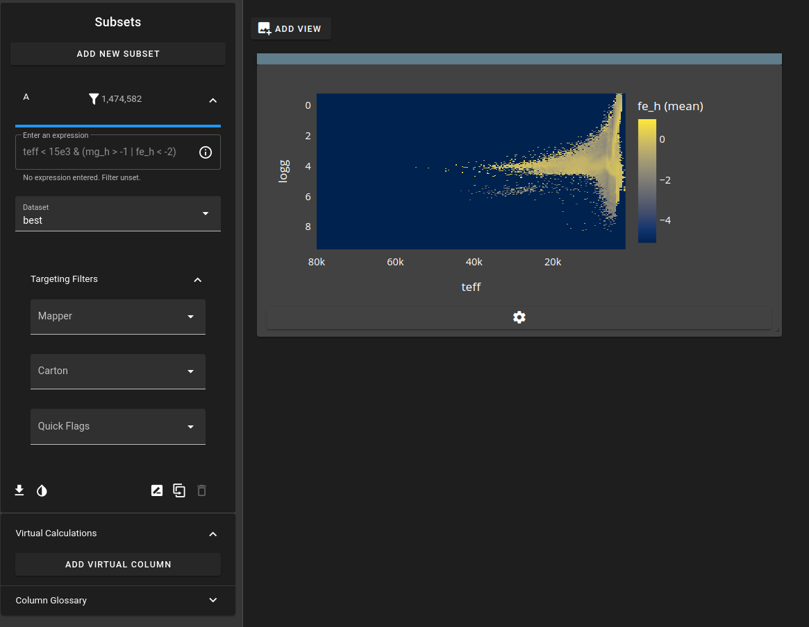
/// caption
*Note the virtual calculation menu on the bottom left in the sidebar*
///

We'll say that `bp_rp` is simply:

$$
BP - RP
$$

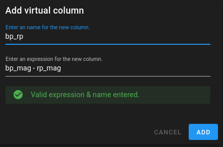
/// caption
*Adding a virtual column under the title `bp_rp`, which is just the BP - RP color index.*
///

Likewise,  the absolute G band magnitude is just:

$$
m_{G} - 5\log_{10}(\bar{\omega} / 1000)
$$

since the parallax column `plx` is given in arcsec. 

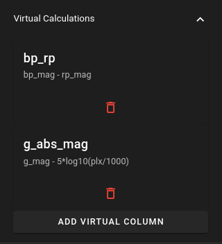
/// caption
*Both virtual columns now appear in the menu, and can be deleted as needed*
///

When we go back to our plot settings menu, we can now actually see the new columns we added!

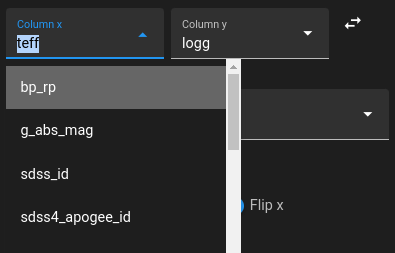
/// caption
*Look at them!*
///

Setting the plot to both of these gives us our CMD.

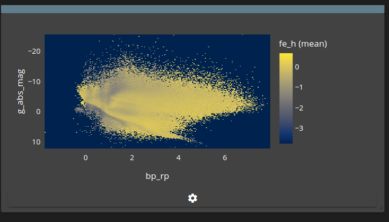

Since the diagram was pretty uninformative, we'll change it to plot the logarithmic count of sources. We'll also filter down to just Milky Way Mapper (`mwm`) targets with the **Targeting Filters**.

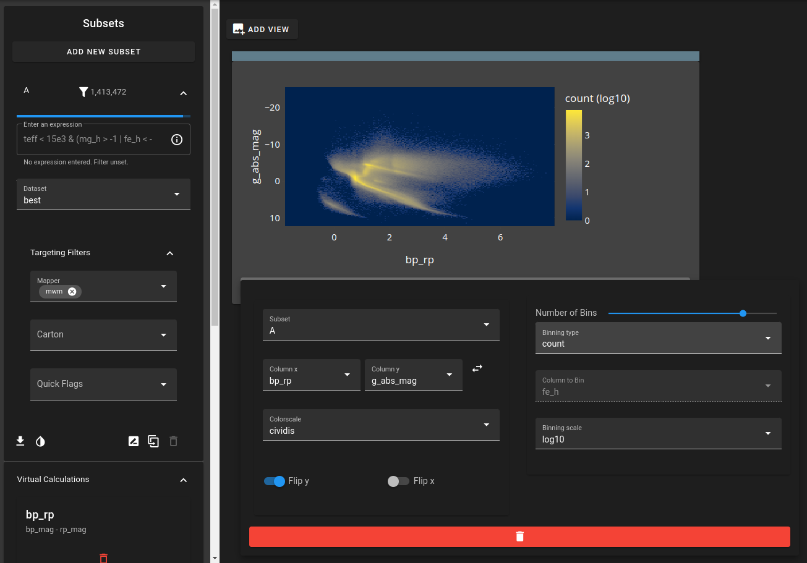

If we restrict it to high S/N targets, and change the colorscale, we can clearly see the main tracks and the red clump. Note the effect of reddening on the color index.

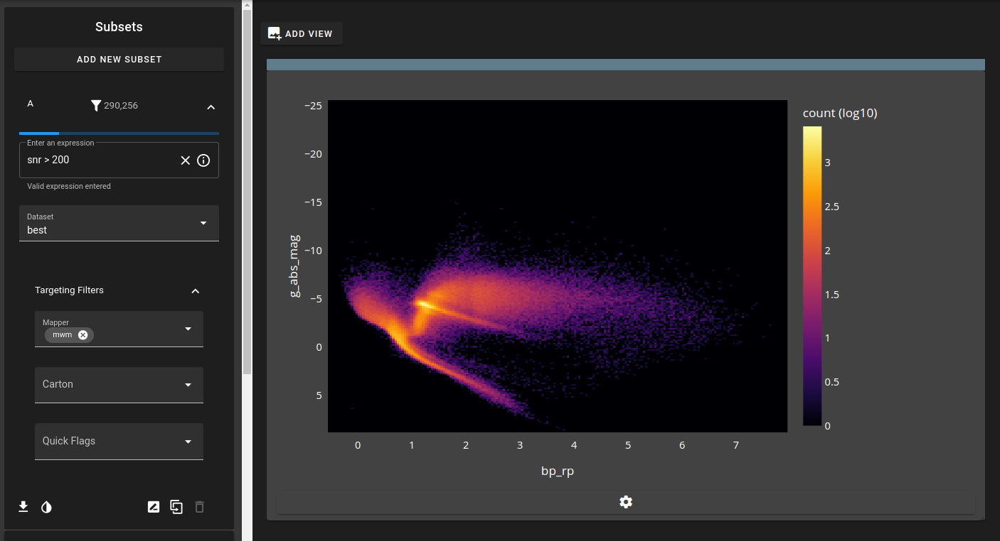

We can additionally add reddening corrections, based on any of the $E(B-V)$ columns, derived from a variety of dustmaps. 

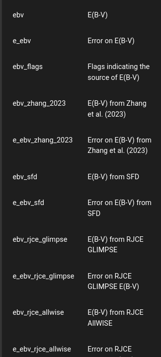
/// caption
*Using the **Column Glossary**, we can look up all the relevant reddening columns in our dataset.*
///

Let's use the `ebv_edenhofer_2023` column. Note that this limits us to bright sources within 1.25 kpc. Nonetheless, we get a much cleaner set of sources with the reddening corrected color.
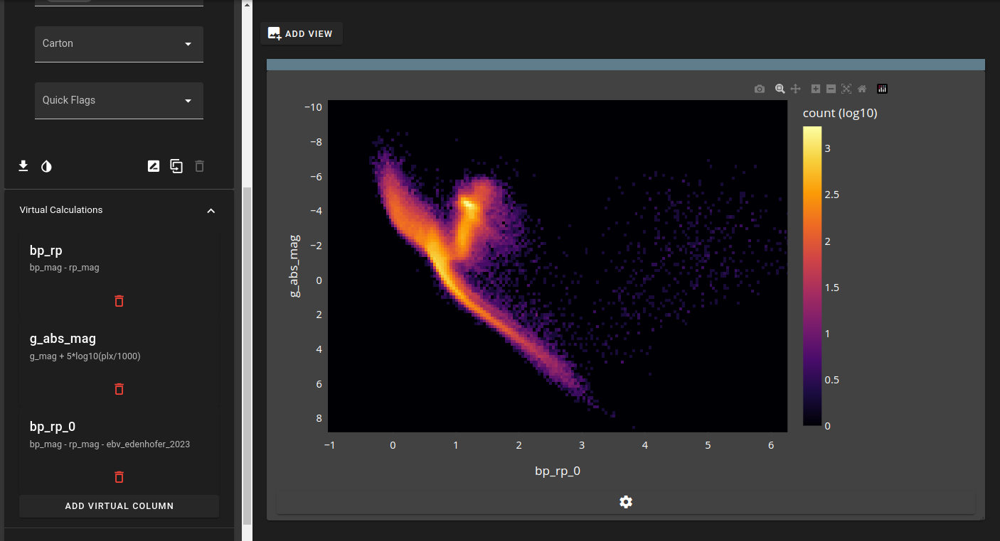
/// caption
*Pretty cool CMD, using the reddening-corrected color.*
///

---
Written by Riley Thai, Dec 11 2024
