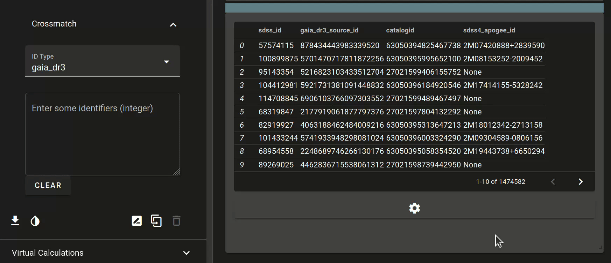

## Crossmatching with Gaia
If you have a list of target identifiers, such as [Gaia](https://esa.gaia.int/) DR3 source identifiers you want to crossmatch with SDSS-V data, you can use the **Crossmatch** menu to find them with Explorer. Simply paste in a selection of identifiers you have (newline separated) and watch it go!

!!! info "Pro Tip!"
    Use the `Targets` View alongside crossmatching to get a good look at your data. You can compare it to our internal `catalogid`!

/// caption
_Filtering down the RGB to some metal-poor giants!_
///

## Changing the identifier type

To change to a different type, say, Gaia Data Release 2 or similar, use the dropdown menu

/// caption
_Changing the identifier type, then crossmatching against APOGEE identifiers from SDSS 4._
///

